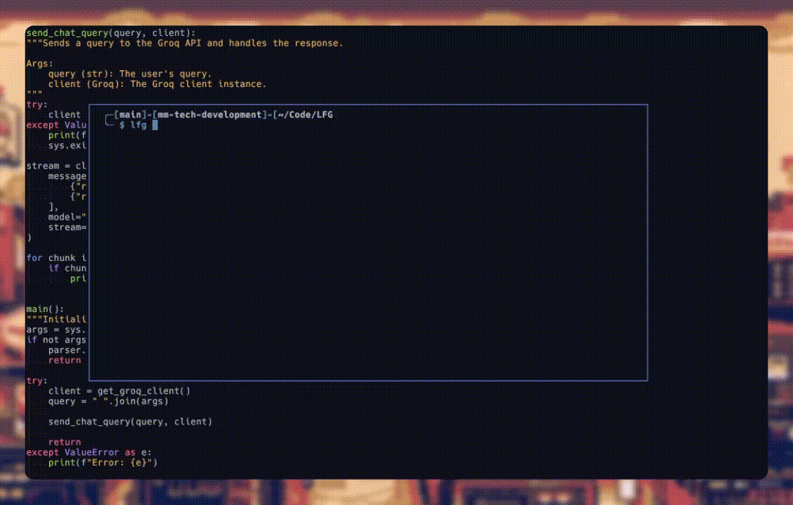

# LFG

> LFG, It Really Whips the Llama's Ass 🦙🦙🦙🦙



LFG is a command-line tool that intelligently helps you find the right terminal commands for your tasks. Such sales pitch.

## Why?

Testing the llama3 model. Initially it was made using ollama locally, but changed to use groq due to not needing to have the llama3 model downloaded.

## Installation

```bash
# install pipx
brew install pipx

# add pipx binaries to path
pipx ensurepath

# restart your terminal
# install LFG
pipx install lfg-llama
```

## Usage

This executable is using Groq, that means you need and [API token](https://console.groq.com/keys).

Groq is free beta, for now.

Add the token to your .bashrc/.zshrc and reload your terminal.

```
export GROQ_API_KEY=1337
```

```
$ lfg [-h] [-m {llama38b,llama370b,mixtral8x7b,gemma7b}] query
```

Now you can use the executable

```bash
lfg "kill port 3000"

# Kill process listening on port 3000
lsof -i :3000 | xargs kill

```

Change the LLM 
```bash 
$ lfg "list ec2 pipe json jq get name" -m llama370b

# List EC2 instances with name

aws ec2 describe-instances --query 'Reservations[].Instances[]|{Name:Tags[?Key==`Name`]|[0].Value,I
nstanceId}' --output text | jq '.[] | {"Name", .Name, "InstanceId", .InstanceId}'

This command uses the AWS CLI to describe EC2 instances, and then pipes the output to `jq` to format the output in a JSON-like format, showing the instance name and ID.
```

### Development

```bash
pip install --user pipenv
pipenv --python 3.11
pipenv install
```

### TODO

- Fix the setup and pyproject file, including github workflow for releasing the package
