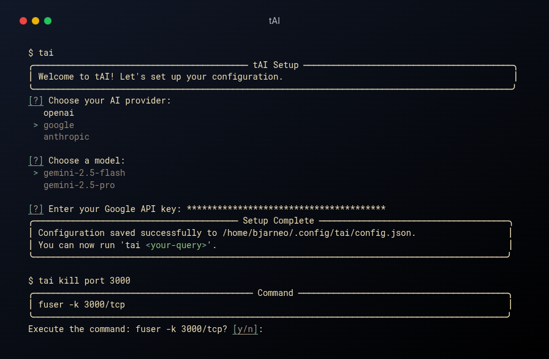

<h1 align="center">tAI, a terminal AI assistant</h1>

<div align="center">
tAI is a CLI that helps you with Linux and macOS terminal commands. Just ask it a question, and it will use AI to suggest a command and explain what it does. If you like the suggestion, the script can automatically run the command for you in your terminal.
</div>
<br />



## Why & What?

- Github Copilot CLI syntax feels clunky to me
- Faster than using Gemini, ChatGPT or similar in a browser
- Simpler to find answers without checking man pages
- **NEW:** Support for multiple AI providers (OpenAI, Google, Anthropic, Groq)
- **NEW:** Interactive TUI setup using `inquirer` for provider and model selection
- **NEW:** Enhanced terminal UI with `rich` for better readability and prompts
- **NEW:** Now you can run commands right from this command-line interface

However, never trust the output entirely.

## Installation

```bash
# install pipx (if you don't have it)
brew install pipx
pipx ensurepath

# install TAI
pipx install terminal-ai-assistant
```

## Usage

On your first run, `tai` will guide you through a quick, interactive setup process to choose your AI provider, select a model from a curated list, and enter your API key. This information will be securely stored in `~/.config/tai/config.json`.

Once configured, you can use `tai` with your queries:

```bash
$ tai kill port 3000

# Example output (formatted with rich):
╭────────────────────────────────────────────────── Command ───────────────────────────────────────────────────╮
│ kill $(lsof -t -i :3000)                                                                                     │
╰──────────────────────────────────────────────────────────────────────────────────────────────────────────────╯

Execute the command: kill $(lsof -t -i :3000)? [y/n]:
```

### Development

```bash
pip install --user pipenv
pipenv --python 3.11
pipenv install

pipenv run tai kill port 3000
```
