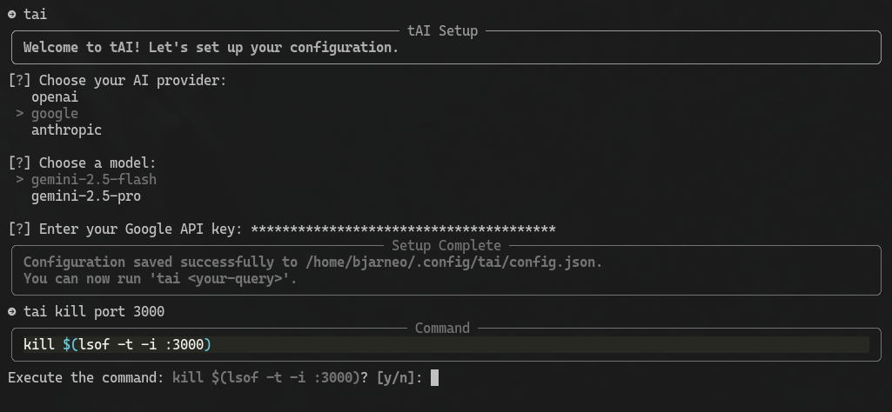

# LFG

> LFG, It Really Whips the Llama's Ass 🦙🦙🦙🦙



LFG is a command-line tool that intelligently helps you find the right terminal commands for your tasks. Such sales pitch. This interface is using GPT-4o as an engine.

## Why?

- Firstly, this was created to test Ollama -> Groq
- I do not like the Github Copilot command-line
- Quicker than using Gemini/ChatGPT/Google directly via the browser interface
- Easier to find what needed without opening man pages
- NEW: Changing to GPT-4o model which is free

However, never trust the output entirely.

## Installation

```bash
# install pipx
brew install pipx

# add pipx binaries to path
pipx ensurepath

# restart your terminal
# install LFG
pipx install lfg-llama
```

## Usage

This executable is using OpenAI, that means you need and [API token](https://platform.openai.com/api-keys).

[GPT-4o](https://platform.openai.com/docs/models/gpt-4o) is free to use.

Add the token to your .bashrc/.zshrc and reload your terminal.

```
export OPENAI_API_KEY={replace_me}
```

You can use either of these commands

```bash
$ lfg <query>
$ ask <query>
```

Now you can use the executable

```bash
$ ask kill port 3000

fuser -k 3000/tcp

Explanation:
The `fuser` command identifies processes using files or sockets. The `-k` option is used to kill th
ose processes. Here, `3000/tcp` specifies the TCP port number 3000. This command effectively kills
any process currently using port 3000.

```

Change the LLM

```bash
$ ask list ec2 pipe json jq get name

aws ec2 describe-instances --query "Reservations[].Instances[].{Name:Tags[?Key=='Name']|[0].Value}"
 --output json | jq -r '.[].Name'

Explanation:
This command uses the AWS CLI to list EC2 instances and their corresponding 'Name' tag values in JS
ON format. The `--query` option filters the output to only include the 'Name' tag for each instance
, and `jq` is used to parse and extract the 'Name' values.%
```

### Development

```bash
pip install --user pipenv
pipenv --python 3.11
pipenv install

pipenv run lfg kill port 3000
```

### TODO

- Fix the setup and pyproject file, including github workflow for releasing the package
